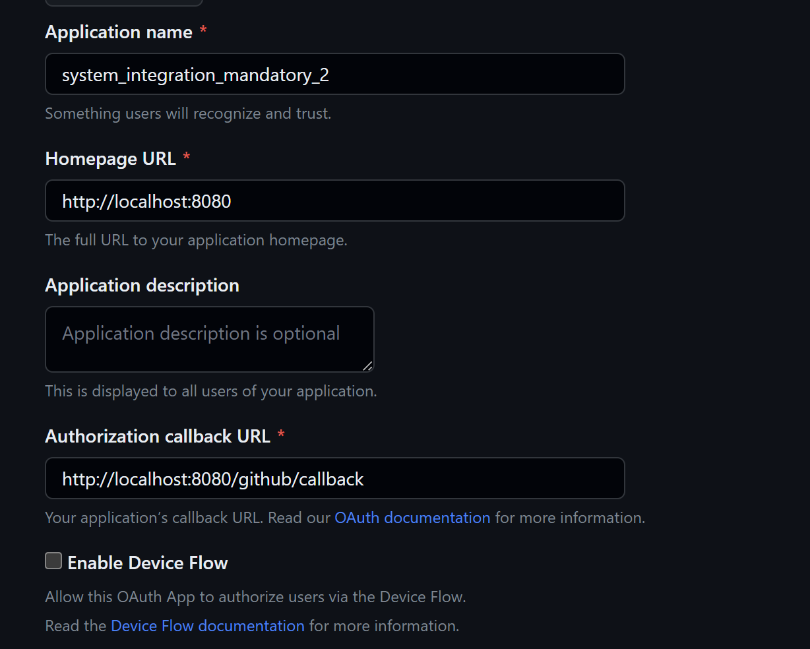

# TUTORIAL

## Step 1

First you need to have a github account. You can create on here: https://github.com/login

## Step 2

You need to create a new Githib oauth app. You can do it here: https://github.com/settings/applications/new

Fill it like this and click create:


## Step 3

Next you need to create a new `secret` for your application, so after you have created the app in the previous page, you should be able to see your `clientId`. Under that you should be able to see a button with an option to `Generate new secret`. Generate it and copy `clientId` and `secret`, as we will need it later in the step 10

## Step 4

Create a new folder where you want your project to be. Create a new file in that folder and name it `package.json` and copy the following content to it:

```
{
  "name": "21-mandatory2-auth",
  "version": "1.0.0",
  "description": "",
  "type": "module",
  "main": "app.js",
  "scripts": {
    "test": "echo \"Error: no test specified\" && exit 1"
  },
  "keywords": [],
  "author": "",
  "license": "ISC",
  "dependencies": {
    "axios": "^1.3.6",
    "dotenv": "^16.0.3",
    "ejs": "^3.1.9",
    "express": "^4.18.2"
  }
}
```

## Step 5

You need to install project dependencies, so just run following command in the root of your project

```
npm i
```

> You need to have `node` installed. If not you need to install `node` first.

## Step 6

Create a new file `app.js` in the root of the project and pass the following into it

```
import dotenv from "dotenv";
import express from "express";
import axios from "axios";

dotenv.config();

const GITHUB_CLIENT_ID = process.env.GITHUB_CLIENT_ID;
const GITHUB_SECRET = process.env.GITHUB_SECRET;
const PORT = process.env.PORT || 8080;

let access_token = "";

const app = express();
app.set("view engine", "ejs");

app.get("/", (req, res) => {
  res.render("pages/index", { client_id: GITHUB_CLIENT_ID });
});

app.get("/github/callback", async (req, res) => {
  const requestToken = req.query.code;

  const response = await axios({
    method: "post",
    url: `https://github.com/login/oauth/access_token?client_id=${GITHUB_CLIENT_ID}&client_secret=${GITHUB_SECRET}&code=${requestToken}`,
    headers: {
      accept: "application/json",
    },
  });

  access_token = response.data.access_token;
  res.redirect("/success");
});

app.get("/success", async (req, res) => {
  const response = await axios({
    method: "get",
    url: `https://api.github.com/user`,
    headers: {
      Authorization: "token " + access_token,
    },
  });
  res.render("pages/success", { userData: response.data });
});

app.listen(PORT, () => console.log("App listening on port " + PORT));

```

## Step 7

Create a new folder structure `/views/pages` in the root of your project.

## Step 8

Create a new file `index.ejs` in the `/views/pages` folder you created in step 7 and copy the following into it

```
<!DOCTYPE html>
<html>
  <head>
    <title>Github OAuth</title>
    <link
      rel="stylesheet"
      href="https://stackpath.bootstrapcdn.com/bootstrap/4.4.1/css/bootstrap.min.css"
    />
    <link
      rel="stylesheet"
      href="https://stackpath.bootstrapcdn.com/font-awesome/4.7.0/css/font-awesome.min.css"
    />
    <style>
      body {
        padding-top: 70px;
      }
    </style>
  </head>
  <body>
    <div class="container">
      <h1>Mandatory 2 - Integrate with an auth service</h1>
      <hr />
      <h1><span class="fa fa-github"></span> Github OAuth</h1>
      <a
        href="https://github.com/login/oauth/authorize?client_id=<%= client_id %>"
        class="btn btn-danger"
        ><span class="fa fa-github"></span> Github Login</a
      >
    </div>
  </body>
</html>

```

## Step 9

Create a new file `success.ejs` in the `/views/pages` folder you created in step 7 and copy the following into it

```
<!DOCTYPE html>
<html>
  <head>
    <title>Github OAuth</title>
    <link
      rel="stylesheet"
      href="https://stackpath.bootstrapcdn.com/bootstrap/4.4.1/css/bootstrap.min.css"
    />
    <link
      rel="stylesheet"
      href="https://stackpath.bootstrapcdn.com/font-awesome/4.7.0/css/font-awesome.min.css"
    />
    <style>
      body {
        padding-top: 70px;
      }
    </style>
  </head>
  <body>
    <div class="container">
      <h1><span class="fa fa-github"></span> Github Information</h1>
      <p>
        <strong>Name</strong>: <%= userData.name %><br />
        <strong>Username</strong>: <%= userData.login %><br />
        <strong>Company</strong>: <%= userData.company %><br />
        <strong>Bio</strong>: <%= userData.bio %>
      </p>
    </div>
  </body>
</html>
```

## Step 10

Create a new file `.env` in the root of the project and pass the following into it and replace thing in brackets with your values from github from step 3.

```
GITHUB_CLIENT_ID=[YOUR CLIENT ID YOU COPIED FROM GITHUB]
GITHUB_SECRET=[YOUR SECRET YOU COPIED FROM GITHUB]
```

## Step 11

To run you app run the following in the root folder

```
node app.js
```

Your app should start at `http://localhost:8080`. Congratz

# Considerations

I have already in my life worked with Google, Facebook and Linkedin OAuth solutions. Here is some of my personal opinions and considerations why I have picked Github to integrate with for this project

## Google

Its is one of the greatest and mosed used OAuth integrations. With its popularity it is very easy to find open source packages that helps one to integrate the login in easy and fast manner and partially hide the flow behind it. Only disadvantage is that the process of setting the login app in google is a bit complicated with many steps and one can easily make mistake in those steps

## Facebook

Its is one of the greatest and mosed used OAuth integrations. With its popularity it is very easy to find open source packages that helps one to integrate the login in easy and fast manner and partially hide the flow behind it. Only disadvantage is that I found the documentation a bit confuding when implementing it and UI seemed a bit not inutitive when I was setting the login app for the first time inf facebook

## Linkedin

Its is one of the biggest social media when it comest to working industry, but its not that much popular when implementing OAuth login. Therefore I found myself doing everything from scratch according the documentation without help of open source packages. Also one thing I did not like was there way they authenticate you app, which can take up to some hours or days

## Guthub

Never worked with github in my life, so i though it would be great to try it out during this project. I found it super easy and straight forward to set up the login app on github, without overwheling endless steps as for example in google. So I liked the overall experience with gitub, but the only problem with github is, that only developer have account at github
